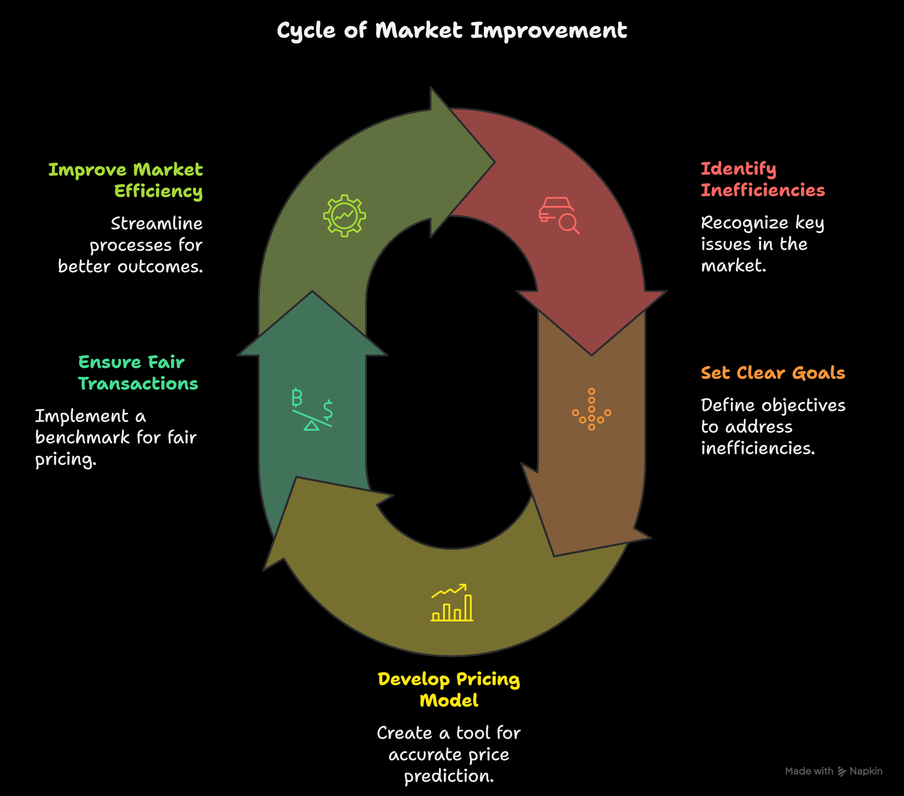
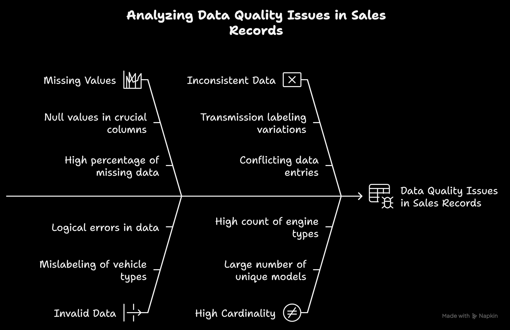
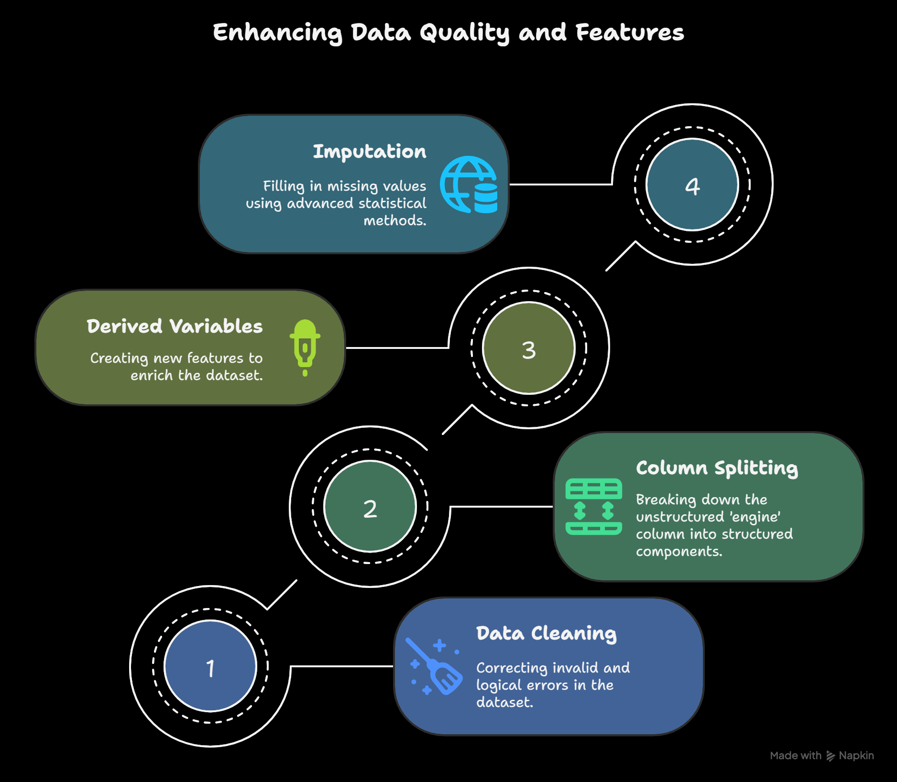
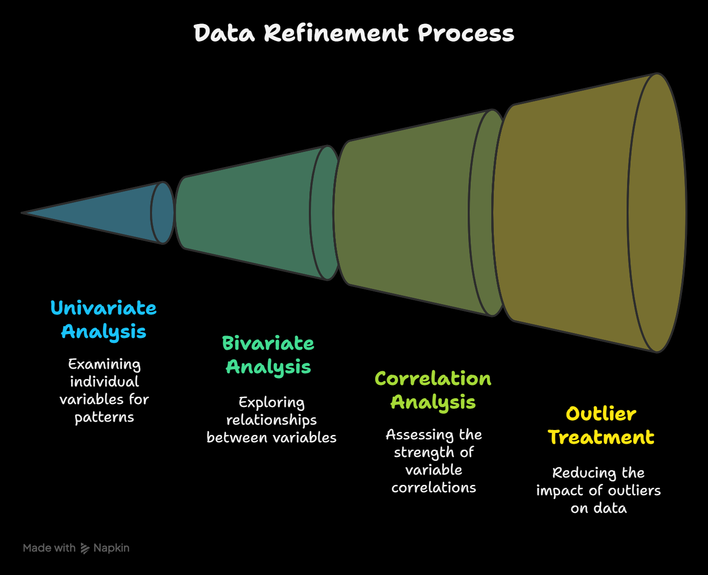
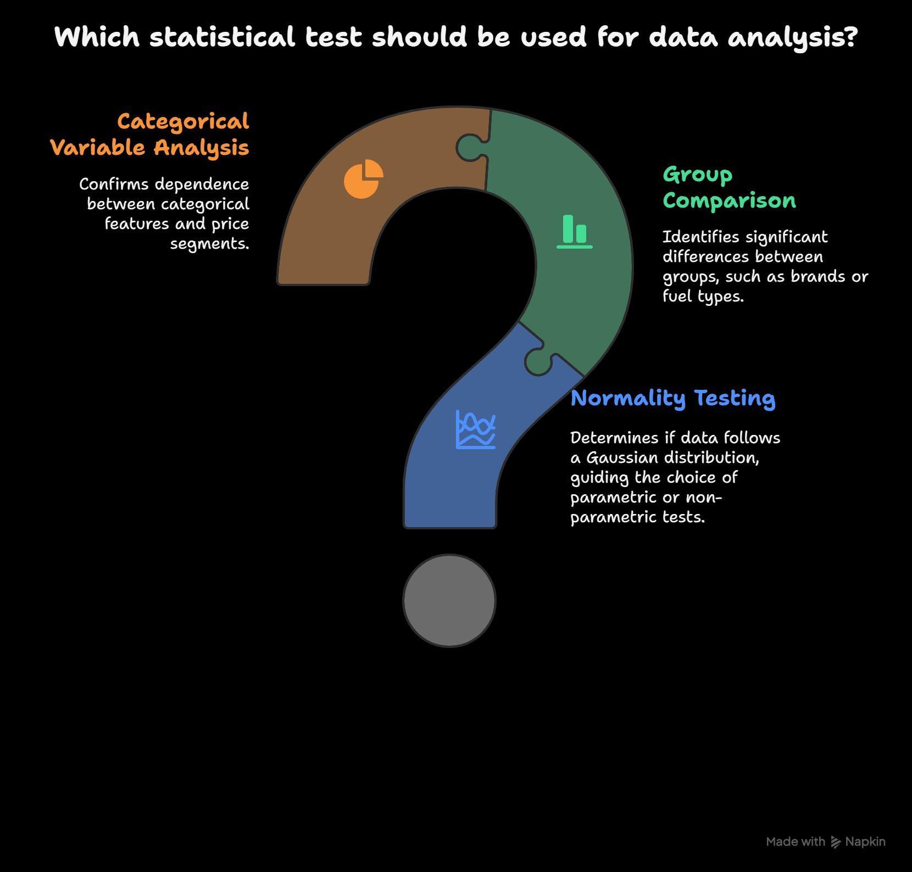
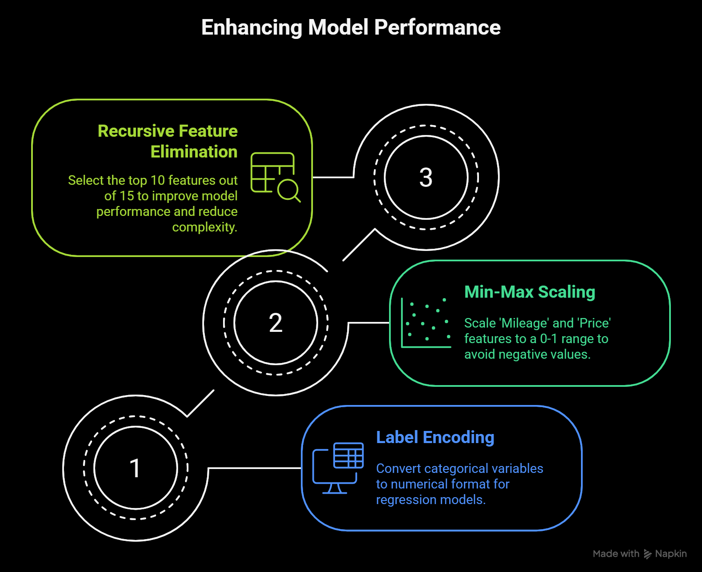
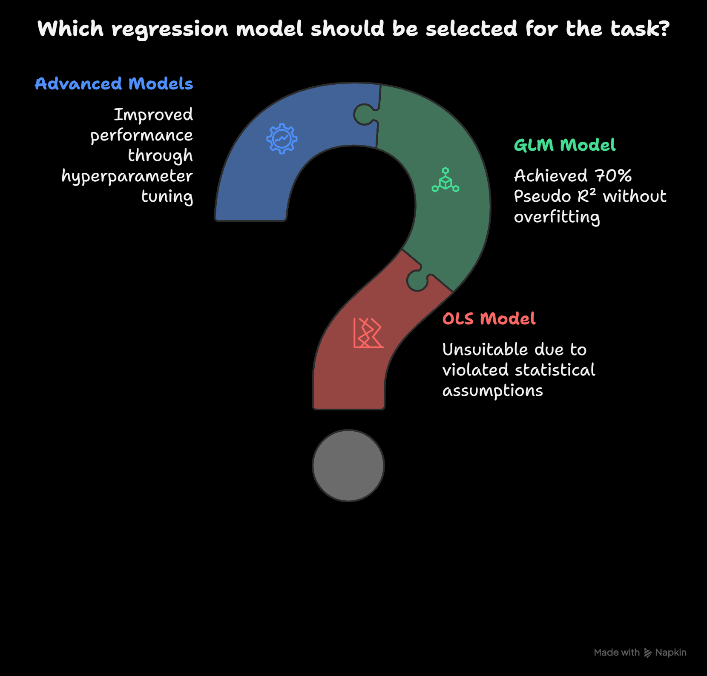
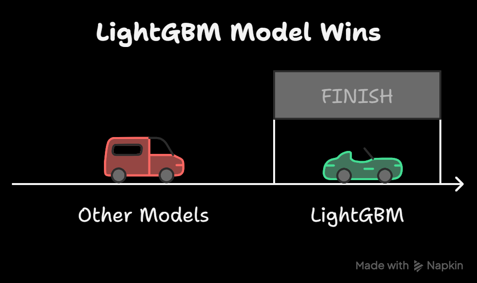

# Used-Car-Price-Prediction
Machine learning pipeline for predicting used car prices using Kaggle’s Playground S4E9 dataset. Includes data cleaning, EDA, feature engineering, statistical analysis, and advanced regression models (LightGBM, XGBoost, CatBoost). Modular notebooks, visuals, and documentation included.

# Used Car Price Prediction Project

## Project Overview

This project develops a machine learning model to predict used car prices accurately, tackling information asymmetry in the used car market. By leveraging a Kaggle dataset with 188,533 sales records, the model provides data-driven insights for buyers and sellers, promoting fair transactions and market efficiency. The workflow includes data collection, cleaning, feature engineering, exploratory data analysis (EDA), statistical testing, preprocessing, model building with hyperparameter tuning, and evaluation. LightGBM emerged as the top performer with an explained variance of 0.6867 and RMSE of 0.1110.

### Business Problems Addressed
- **Information Gap for Buyers**: Buyers often lack reliable data to assess fair prices, leading to overpayment or poor decisions.
- **Suboptimal Returns for Sellers**: Inaccurate pricing results in lost revenue or prolonged sales.
- **Market Inefficiency**: Without a trusted pricing benchmark, transactions are unfair and inefficient.

### Project Goals
- Develop an ML model for precise price forecasting.
- Establish a reliable pricing standard for equitable deals.
- Enhance market dynamics with actionable insights.

### Project Phases
1. Business Problems and Goals
2. Data Collection and Understanding
3. Data Cleaning
4. Feature Engineering
5. Exploring and Visualizing Data (EDA)
6. Statistical Analysis
7. Data Preprocessing and Feature Selection
8. Advanced Regression Models and Hyperparameter Tuning
9. Comparison of Best Model
10. Conclusion and Future Scope

## Data Collection and Understanding

### Data Source
- Kaggle Competition: [Playground Series S4E9](https://www.kaggle.com/competitions/playground-series-s4e9)
- Author: Srinivasa Rao Bittla
- Published: 2024

### Dataset Characteristics
- Size: 188,533 records, 13 columns.
- Key Features: Brand, model, model year, mileage, fuel type, engine, transmission, color, accident, clean title.
- Target: Price (numerical).
- Column Types: 4 numerical (id, model year, mileage, price), 9 categorical.
- High Cardinality: Model (1,897 unique), Engine (1,117 unique).

### Data Quality Issues
- Missing Values: clean_title (11.36%), fuel_type (2.70%), accident (1.30%).
- Invalid Values: Encoding errors in fuel_type ("â\x80\x93" in 781 rows), logical errors (369 Teslas labeled as Gasoline/Diesel).
- Inconsistencies: Transmission labeled as “A/T” or “Automatic”.
- No duplicates or zero values; data integrity intact.

## Data Cleaning

- **Handling Invalid Values**:
  - Converted "â\x80\x93" in fuel_type to null.
  - Corrected Tesla fuel_type to "Electric".
- **Column Removal**: Dropped CLEAN_TITLE due to high missing data and lack of variance (only "Yes" when present).

## Feature Engineering

- **Primary Technique**: Column Splitting on 'engine' using OpenRefine (separator: "HP").
  - Created: HP, Litres, Cylinder, engine fuel type.
  - Benefit: Transformed unstructured data into predictive features.
- **Additional Techniques**:
  - Derived variables: fuel_type_new, color_category.
  - Reduced levels: Top 10 categories for model year, model, brand, colors, transmission (for visualization).
- **Imputation**: MICE (Multiple Imputation by Chained Equations) using Cylinder, Litres, HP, Brand, Model.
  - Preferred over mean/median: Preserves relationships, reduces bias.

## Exploring and Visualizing Data (EDA)

### Univariate Analysis
- Continuous: Mileage (right-skewed, low-mileage dominant), HP (200–400 range), Litres (peaks at 2.0, 3.0–3.5, 5.0).
- Discrete: Brands (Ford, Mercedes top), Model Year (2021+ common), Fuel Type (Gasoline dominant), Transmission (mostly automatic).

### Bivariate Analysis
- Numerical vs. Price: Higher HP/Litres/Cylinders/Model Year → Higher price; Lower Mileage → Higher price.
- Categorical vs. Price: Porsche highest (brand), Electric highest (fuel), W-layout engines priciest.

### Correlation
- Strong: Litres & Cylinders (0.85), Model Year & Mileage (-0.67).
- Moderate: HP & Litres (0.55).

### Outlier Treatment
- Winsorization: Capped HP, Mileage, Price at upper quartile; Litres at both ends.
- Post-treatment: No outliers via IQR.

## Statistical Analysis

- **Normality Testing**: D’Agostino’s K² Test – All numerical variables non-normal (p=0.000). Implication: Use non-parametric tests or transformations.
- **Kruskal-Wallis Test**: Significant differences across groups (e.g., brands, fuel types; p<0.05).
- **Dunn’s Post Hoc Test**: Pairwise comparisons (e.g., Porsche vs. Ford significant; Audi vs. Chevrolet not).
- **Chi-Square Test of Independence**: Significant associations between categoricals and binned price (all p=0.000).
- **Chi-Square Contingency Test**: Revealed brand distributions across price bins (e.g., Porsche mostly high-price).

## Data Preprocessing and Feature Selection

- **Preprocessing**:
  - Encoding: Label encoding for categoricals.
  - Scaling: Min-Max for Mileage and Price (0-1 range; avoids negatives from Standard/Robust scalers).
- **Feature Selection**: Recursive Feature Elimination (RFE) – Selected top 10 features.
  - Why RFE: Reduces dimensionality, prevents overfitting, improves interpretability.

## Advanced Regression Models and Hyperparameter Tuning

- **Base Model (OLS)**: Unsuitable – Violated linearity and normality assumptions.
- **GLM (Gaussian)**: Pseudo R²=70%, Train RMSE=0.1334, Test RMSE=0.1348.
- **Other Models**: Linear Regression, Decision Tree, Random Forest, KNN, XGBoost, CatBoost, LightGBM.
- **Evaluation**: 10-fold CV, Metrics: RMSE, Explained Variance.
- **Tuning**: Bayesian optimization.
- **Results**:
  | Model          | Tuned RMSE (±SD) | Tuned Explained Variance |
  |----------------|------------------|--------------------------|
  | GLM            | 0.130 ± 0.001   | 0.567                   |
  | Decision Tree  | 0.1147 ± 0.001  | 0.6654                  |
  | Random Forest  | 0.115 ± 0.001   | 0.662                   |
  | LightGBM       | 0.1110 ± 0.001  | 0.6867                  |
  | CatBoost       | 0.112 ± 0.001   | 0.680                   |

## Comparison of Best Model

- **Best Model**: LightGBM.
  - Advantages: Efficient for large data, handles complex interactions, scalable.
  - Outperformed GLM in RMSE and Explained Variance.

## Conclusion and Future Scope

- **Conclusion**: Achieved accurate predictions with LightGBM, improving market transparency.
- **Future Scope**:
  - Add recent data.
  - Explore deep learning/ensembles.
  - Collaborate with platforms like CarDekho.
  - Deploy as SaaS, A/B test, monitor metrics.

## Installation and Usage

### Requirements
- Python 3.12+
- Libraries: numpy, pandas, scikit-learn, lightgbm, catboost, xgboost (install via `pip install -r requirements.txt`)

### Running the Project
1. Clone the repo: `git clone https://github.com/gaja-123/Used-Car-Price-Prediction.git`
2. Download dataset from Kaggle `https://www.kaggle.com/competitions/playground-series-s4e9/data` 
3. Run Notebooks: Execute individual notebooks for each model (e.g., LGBM, XGBoost, CatBoost, RF, KNN). Each file represents a modular component of the pipeline, allowing focused experimentation, tuning, and comparison.

## Contributing
Pull requests welcome! For major changes, open an issue first.

## License
MIT License - see [LICENSE](LICENSE) for details.

## Acknowledgments
- Dataset: Kaggle Playground Series S4E9
- Tools: OpenRefine, scikit-learn, LightGBM
- Visuals: Created with Napkin
